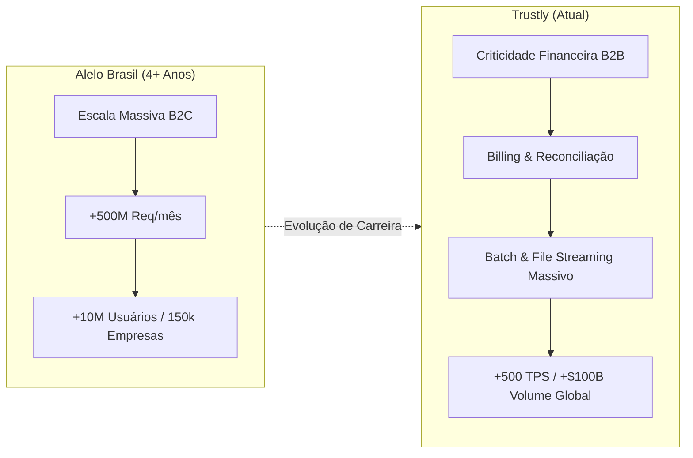

# Brainstorm Intent: Modernização do Portfólio & CV Executivo

> **Status:** Aprovado para Especificação / Implementação  
> **Data de Atualização:** 2026-09-16  
> **Autor/Perfil:** Vinicius R. Silva — Senior Software Engineer (Backend & Distributed Systems)  
> **Arquivo Canônico de Origem:** `_bmad-output/brainstorming/brainstorm-portfolio-cv-modernization-2026-09-16/.memlog.md`  
> **Finalidade:** Servir como diretriz de entrada técnica para os workflows downstream (`bmad-prd`, `bmad-spec`, `bmad-build`).

---

## 1. Executive Context & Objective

- **Objetivo Estratégico:** Reposicionar a presença digital e o currículo de Vinicius R. Silva de um perfil descritivo tradicional para uma vitrine executiva de engenharia sênior de alto sinal técnico.
- **Público-Alvo:** Hiring Managers, Tech Leads e Staff/Principal Engineers em empresas globais (fintechs, big techs e scale-ups de alto impacto - US/BR/EU).
- **Diretriz de Design & Tom:**
  - Estética minimalista ultra-sóbria (inspirada em referências como Linear, Stripe e Vercel): paleta *slate/zinc*, *dark mode* nativo como cidadão de primeira classe, tipografia técnica (*Inter* + *JetBrains Mono*).
  - Alto sinal técnico, ruído zero: eliminação completa de chavões, adjetivos vagos e slogans publicitários em favor de métricas auditáveis e entregas factuais.
  - *Show, Don't Tell:* Substituição de listas passivas de projetos por demonstrações interativas vivas de engenharia (sandbox de regras financeiras e terminal animado).
  - Autoridade Holística: Convergência harmônica entre escala corporativa crítica (Trustly e Alelo), contribuição *open source* de relevância global (MockK v1.14.0) e formação acadêmica de ponta (MBA USP/Esalq concluído + UNESP).

---

## 2. Hero & Executive Positioning Specification

- **Identidade Principal:** `Vinicius R. Silva`
- **Cargo / Headline:** `Senior Software Engineer | Backend & Distributed Systems`
- **Proposta de Valor Factual (2 linhas, sem slogans):**
  > Especialista em arquiteturas distribuídas no ecossistema JVM (Java/Kotlin), processamento de pagamentos em larga escala e sistemas críticos de faturamento B2B (*Billing & Reconciliação*). Histórico comprovado operando plataformas com volumes superiores a **500M+ req/mês** e processamento financeiro global de **+$100B**.
- **Elementos de Conversão & Status:**
  - **Availability Badge:** Badge sutil com indicador pulsante: `Open to select senior/staff opportunities (Remote / Hybrid)`.
  - **Primary CTA:** Download de CV em PDF atualizado (layout ATS-friendly minimalista de 1-2 páginas).
  - **Secondary CTAs:** Conexão direta via LinkedIn, acesso ao GitHub e botão de e-mail direto pré-formatado.

---

## 3. Work History & Metrics Architecture

A narrativa de carreira adota o modelo de **Dualidade Estratégica**: alto rendimento B2C com escala massiva de requisições aliado à altíssima criticidade financeira B2B e orquestração assíncrona/batch.



### 3.1. Trustly (Empresa Atual — Senior Software Engineer)
- **Domínio de Negócio:** Core B2B Backoffice, Billing de alta criticidade e Reconciliação Financeira para *merchants* internacionais.
- **Desafios de Engenharia & Arquitetura:**
  - **Engine de Faturamento & Cobrança (Billing):** Implementação de regras financeiras rigorosas e pipelines transacionais de cobrança para milhares de parceiros comerciais.
  - **Processamento Assíncrono & Batch em Larga Escala:** Arquitetura de geração, cálculo e reconciliação de relatórios analíticos massivos (*Reports*) utilizando *Spring Batch* e *Quartz Scheduler*.
  - **Engenharia de Payloads & File Streaming:** Mecanismos de *streaming* reativo para geração e entrega de arquivos massivos (PDFs/ZIPs criptografados), integração com *AWS S3*, *Lambdas* serverless e transporte seguro automatizado via *SFTP*.
  - **Stack Poliglota & SQL Complexo:** Domínio profundo da JVM navegando entre múltiplos paradigmas e *frameworks* (*Spring Boot*, *Javalite*, *Google Guice*), além de modelagem relacional avançada e consultas de alta performance em *PostgreSQL*.
- **Métricas de Escala da Plataforma Global:**
  - **+500 TPS** de pico de processamento.
  - **+$100B** em volume total processado anualmente.
  - **+110M** de consumidores atendidos e **+9k** *merchants* em mais de 30 países.

### 3.2. Alelo Brasil (Consolidado 4+ Anos de Trajetória)
- **Domínio de Negócio:** Meios de pagamento corporativos, benefícios e cartões pré-pagos em escala nacional.
- **Evolução Técnica:** Consolidação de uma trajetória de 4+ anos (evolução contínua de desenvolvedor até liderança técnica de microsserviços de pagamento).
- **Desafios de Engenharia & Resiliência:**
  - Desenvolvimento e sustentação de microsserviços resilientes em Java/Spring com comunicação orientada a eventos.
  - Migração de sistemas legado para arquitetura em nuvem com tolerância a falhas e estratégias de *circuit breaker*.
- **Métricas Consolidadas:**
  - **+500M** de requisições processadas mensalmente.
  - **+150.000** empresas clientes ativas no ecossistema.
  - **+10.000.000** de usuários finais e portadores de cartões.

---

## 4. Featured Projects Interactive Specs

A seção de projetos elimina cards estáticos genéricos e foca estritamente em **dois projetos de alta densidade técnica**, com componentes interativos vivos no navegador.

### 4.1. Projeto 1: Antifraud System (Financial Security Engine)
- **Descrição Técnica:** Motor modular de análise de risco e combate à fraude em transações de cartões e pagamentos instantâneos.
- **Padrões de Engenharia Implementados:**
  1. **Calibração Dinâmica com Amortecimento (*Human-in-the-loop*):** Fórmula de média ponderada com amortecimento exponencial onde o feedback do analista recalibra o modelo com taxa `0.8` (peso histórico) e `0.2` (ajuste corretivo humano).
  2. **Detecção Espaço-Temporal por Janela Deslizante (*Sliding Window*):** Análise heurística em janela de 60 minutos para identificar anomalias de velocidade de compra (*velocity checks*) e dispersão geográfica impossível (ex: transações físicas em cidades distantes em minutos).
  3. **Segurança & Governança Baseada em Papéis (*RBAC*):** Segregação estrita de privilégios (`MERCHANT`, `ADMIN`, `SUPPORT`) com auditoria transacional imutável.
- **Especificação do Componente Interativo (Sandbox Widget no Card):**
  - Controles de entrada no card: *Slider* de valor da transação, *input* de delta de tempo (minutos desde a última compra) e distância geográfica estimada (km).
  - Botão de ação: `Simular Transação`.
  - Saída visual reativa:
    - *Score de Risco* calculado em tempo real (0 a 100).
    - Status instantâneo com tag visual: `APPROVED` (Verde), `FLAGGED / REVIEW` (Amarelo) ou `REJECTED` (Vermelho).
    - Box de inspeção técnica detalhando os fatores atuantes: *Velocity Factor*, *Geographic Jump Penalty* e *Damping Weight applied*.

### 4.2. Projeto 2: dotme (Modern Dotfiles Manager & CLI Tool)
- **Descrição Técnica:** Utilitário CLI nativo para gestão declarativa de ambientes de desenvolvimento, orquestrando sincronização atômica de arquivos de configuração através de links simbólicos seguros.
- **Padrões de Engenharia Implementados:**
  - Filtragem por padrões glob (*pattern-based glob filtering*).
  - Verificação atômica de conflitos de *symlinks* com reversão segura (*safe rollbacks*).
  - Pipeline contínuo de automação com *GitHub Actions*, *semantic release* de binários e suite automatizada de testes unitários.
- **Especificação do Componente Interativo (Animated Loop Terminal):**
  - Componente que emula um terminal Unix elegante (*JetBrains Mono*, botões de janela macOS, fundo dark puro).
  - **Comportamento Autônomo (*Typewriter Loop*):**
    - Executa uma sequência animada contínua demonstrando o uso prático sem exigir digitação manual do visitante.
    - Exibe a digitação do comando `dotme sync --verbose`, animação de processamento, identificação de arquivos `.zshrc`, `.gitconfig` e saída colorida com status: `✓ Linked [ok]`, `✓ Zero conflicts detected`.
    - Transição suave e reinício do loop após pausa de 4 segundos.

---

## 5. Open Source & Community Hub Specs

Substitui telas isoladas de código por um **Mural de Ecossistema Open Source**, evidenciando cidadania técnica global e credibilidade comunitária.

| Ativo / Projeto | Papel & Tipo | Escopo & Impacto Técnico | Badge / Link de Prova |
| :--- | :--- | :--- | :--- |
| **MockK (v1.14.0)** | Core Contributor (PR Aceito) | Correção crítica de vazamento de estado (*state leak*) no método `confirmVerified`, garantindo isolamento hermético entre baterias de testes unitários em Kotlin. | `Release v1.14.0` / Link GitHub |
| **dotme** | Criador & Mantenedor | Ferramenta CLI de gerenciamento declarativo de dotfiles com empacotamento, CI/CD e testes automatizados. | `Active Creator` / Repositório Público |
| **n8n-docs** | Contribuidor | Melhorias na documentação técnica oficial e exemplos de integração da plataforma líder de workflow automation. | `Contributor` / Repositório Oficial |
| **microbot** | Criador & Desenvolvedor | Utilitários de automação e scripts utilitários focados em produtividade de desenvolvimento. | `Open Source Tool` / Repositório |

---

## 6. Architectural Skills Classification & AI-Augmented Engineering Layer

Reestruturação completa das habilidades em **4 camadas arquiteturais puras**, eliminando tags desconexas e destacando a fluência em IA moderna aplicada ao SDLC:

### Camada 1: Backend Core & JVM Ecosystem
- **Linguagens & Runtimes:** Java (8, 11, 17, 21+), Kotlin.
- **Frameworks & DI:** Spring Framework (Boot, Data, Security, Batch), Javalite, Google Guice.
- **Engenharia de Execução:** Concorrência, Multithreading, Thread Pools, Reactive & Event Loops.

### Camada 2: Distributed Systems, Data & Scale
- **Engenharia de Dados Relacional:** PostgreSQL avançado (tuning de índices, queries complexas, particionamento e lock isolation).
- **Processamento Assíncrono:** Spring Batch, Quartz Scheduler, File Streaming (PDFs/ZIPs de alta volumetria), workers distribuídos.
- **Mensageria & Caching:** Redis, RabbitMQ / Apache Kafka, Webhooks resilientes e idempotência transacional.

### Camada 3: Cloud, DevOps & Security Architecture
- **Cloud Infrastructure (AWS):** AWS S3, AWS Lambda (Serverless), CloudWatch, IAM Policies.
- **Entrega & Protocolos:** Integração automatizada e segura via SFTP, REST APIs de missão crítica, RPC.
- **Containers & Automação:** Docker, Kubernetes básico, GitHub Actions CI/CD, Linux internals.

### Camada 4: AI-Augmented Engineering & Modern SDLC
- **Sistemas & Contexto de IA:** RAG (*Retrieval-Augmented Generation*), MCP (*Model Context Protocol*), integração de LLMs em fluxos de trabalho corporativos.
- **Orquestração de Agentes:** Arquitetura multi-agente, desenvolvimento de *skills* e subagentes com BMAD Framework.
- **Ferramental de Próxima Geração:** Claude Code, Gemini CLI, Opencode, engenharia de contexto e testes de regressão assistidos por IA.

---

## 7. Academic Credentials

Posicionamento acadêmico de elite, demonstrando equilíbrio entre fundamentação teórica sólida e gestão moderna de engenharia:

1. **USP / Esalq (Universidade de São Paulo):**
   - **Grau:** MBA em Engenharia de Software.
   - **Status:** **CONCLUÍDO** (Atualização obrigatória sobre versões anteriores).
   - **Foco Acadêmico:** Arquitetura de sistemas distribuídos, padrões de projetos corporativos, governança de qualidade de software e liderança técnica.
2. **UNESP (Universidade Estadual Paulista):**
   - **Grau:** Graduação em Tecnologia / Ciência da Computação.
   - **Status:** Concluído.
   - **Foco Acadêmico:** Algoritmos, estruturas de dados fundamentais, redes e sistemas operacionais.

---

## 8. High-Conversion Contact & Availability Blueprint

Elimina formulários estáticos tradicionais que costumam apresentar falhas de envio e cria pontos de conversão imediata de baixa fricção:

- **Status Banner:** Componente visual discreto com luz verde ativa e texto:  
  `🟢 Disponível para novas oportunidades selecionadas (Remoto / Híbrido - Brasil ou Internacional)`
- **Download do Currículo (ATS-Friendly):**
  - Botão de destaque com ícone de documento e indicador `PDF (Atualizado 2026)`.
  - Acesso direto ao documento otimizado para sistemas de triagem de RH (ATS) e legibilidade imediata por diretores técnicos.
- **Direct Executive Email (mailto Otimizado):**
  - Botão de e-mail com acionamento nativo estruturado para facilitar o contato:
    - *Subject:* `Oportunidade / Contato: Senior Software Engineer - Vinicius R. Silva`
    - *Body Template:* Sugestão pré-preenchida para apresentação de oportunidade ou convite para alinhamento.
- **Canais Profissionais Diretos:** Links com ícones e métricas de perfil para LinkedIn e GitHub.

---

## 9. Technical MoSCoW Implementation Matrix & Component File Mapping

### 9.1. Matriz MoSCoW de Priorização

```
+---------------------------------------------------------------------------------------+
| MUST HAVE (P0 - Bloqueadores de Qualidade)                                            |
| - Hero minimalista executivo com headline correta e métricas factuais                 |
| - Atualização da experiência com Trustly (B2B Billing, Reports, Batch, SFTP, S3)      |
| - Consolidação da Alelo em bloco único de impacto (4+ anos, 500M+ req/mês)            |
| - Atualização acadêmica: MBA USP/Esalq com status CONCLUÍDO                           |
| - Reestruturação de Skills em 4 camadas arquiteturais + AI-Augmented Engineering      |
| - Download direto de CV em PDF alinhado às novas métricas                             |
+---------------------------------------------------------------------------------------+
| SHOULD HAVE (P1 - Diferenciais de Conversão & Impacto)                                |
| - Sandbox interativo no card do Antifraud System (simulação de regras em tempo real)  |
| - Terminal animado em loop (typewriter effect) no card do dotme                       |
| - Mural/Grid do ecossistema Open Source (MockK v1.14.0, dotme, n8n-docs, microbot)    |
| - Availability Badge ativo e link mailto executivo pré-formatado                      |
+---------------------------------------------------------------------------------------+
| COULD HAVE (P2 - Refinamentos de UX)                                                  |
| - Tooltips táteis com contexto sobre KPIs de volume e links para PRs                  |
| - Sincronização fluida com o dicionário de internacionalização PT/EN                  |
+---------------------------------------------------------------------------------------+
| WON'T HAVE (P3 - Descartados Conscientemente)                                         |
| - Visualizador de PR diff interativo para MockK (ruído e detalhamento excessivo)      |
| - Emulador de terminal dotme dependente de digitação manual do visitante              |
| - Formulários de contato estáticos quebradiços em PHP/serviços de terceiros           |
| - Slogans genéricos ou autoelogios sem métricas comprobadas                           |
+---------------------------------------------------------------------------------------+
```

### 9.2. Mapeamento de Componentes & Arquivos do Código

A arquitetura do portfólio utiliza componentes HTML modulares carregados assincronamente pelo script principal. O mapeamento direto de implementação é:

| Componente / Arquivo | Responsabilidade Técnica de Implementação |
| :--- | :--- |
| `index.html` | Atualização das meta tags SEO (OpenGraph, descrição técnica executiva, títulos) e contêineres estruturais. |
| `components/hero.html` | Renderização do Headline executivo, métricas de alto nível, Availability Badge pulsante e CTAs de conversão. |
| `components/experience.html` | Bloco prioritário da **Trustly** (detalhando Billing, Reports, Batch e escala global) e bloco unificado da **Alelo** (trajetória 4+ anos e volume 500M+ req/mês). |
| `components/projects.html` | Implementação do card com **Sandbox Interativo do Antifraud** e do card com o **Terminal em Loop Animado do dotme**. |
| `components/about.html` / `opensource.html` | Implementação do **Mural de Ecossistema Open Source** (MockK v1.14.0, dotme, n8n-docs, microbot). |
| `components/skills.html` | Reorganização do layout de tags para a matriz de **4 Camadas Arquiteturais** (Core JVM, Distributed Systems, Cloud & DevOps, AI-Augmented Engineering). |
| `components/education.html` | Atualização do status do MBA em Engenharia de Software da **USP/Esalq** para **Concluído**, mantendo o alinhamento com a **UNESP**. |
| `components/contact.html` | Blueprint de conversão executiva com botão mailto otimizado, links LinkedIn/GitHub e gatilho de CV. |
| `js/script.js` | Lógica interativa client-side: motor de simulação do Sandbox do Antifraud (cálculo de score dinâmico) e loop de animação typewriter do terminal dotme. |
| `js/translations.js` | Dicionário bilíngue atualizado com as novas nomenclaturas e métricas para suporte aos idiomas Português e Inglês. |
| `assets/` | Inclusão da versão mais recente do CV em PDF ATS-Friendly e eventuais ícones vetoriais necessários. |

---

## 10. Downstream Skill Readiness & Next Steps

Este documento serve como contrato de requisitos técnicos. A ordem recomendada de execução no ecossistema BMAD é:
1. **`bmad-spec` / `bmad-prd`**: Formalização das especificações finas dos componentes JavaScript (Sandbox e Terminal animado).
2. **`bmad-build`**: Implementação direta nos arquivos `components/*.html`, `js/script.js` e `js/translations.js` conforme o mapeamento acima.
