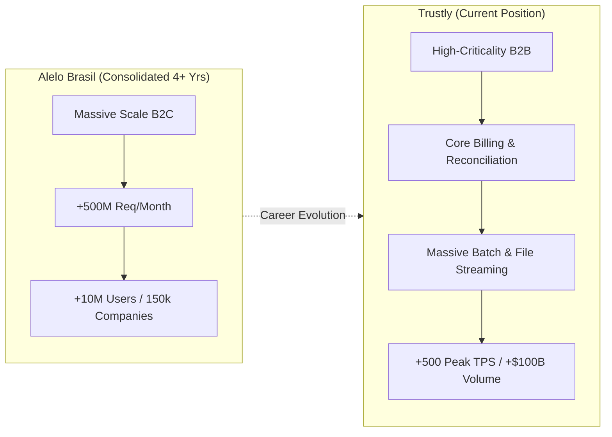

# Architecture Diagrams

## Career Narrative: Strategic Scale Duality

Visual representation of career evolution balancing mass-scale B2C request volume and mission-critical B2B financial processing.

